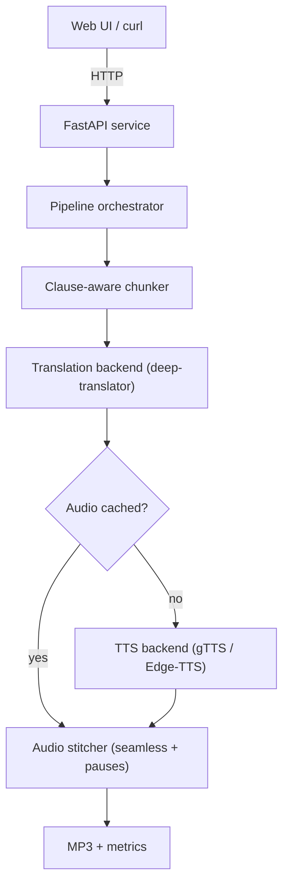

# Basha — Multilingual Text-to-Speech & Localization Service

> A CPU-friendly, free-first service that turns English text into **translated, narrated audio**
> across European and Indian languages — with a multi-voice "audio drama" mode and a built-in
> quality-measurement layer.

`Basha` (भाषा — "language / speech") takes a block of English text, translates it into a target
language, and synthesizes natural narrated audio. It is built as a **service**, not a script:
a FastAPI backend with a swappable TTS layer, an audio cache, async long-form jobs, structured
logging, and a clean web UI on top. Everything in the default path runs **free and on CPU** —
no GPU required.

---

## Table of contents

1. [What it does](#what-it-does)
2. [Features](#features)
3. [Supported languages](#supported-languages)
4. [Architecture](#architecture)
5. [Project structure](#project-structure)
6. [Tech stack](#tech-stack)
7. [Getting started](#getting-started)
8. [API reference](#api-reference)
9. [How quality is measured](#how-quality-is-measured)
10. [Design decisions](#design-decisions)
11. [Future work](#future-work)

---

## What it does

```
text ──▶ Chunker ──▶ Translation ──▶ TTS ──▶ Stitcher ──▶ audio
       (clause-aware)  (deep-translator)  (gTTS / Edge-TTS)  (seamless joins)
```

- **Input:** plain English text (single narration) or a `Speaker: line` script (audio drama).
- **Localize:** translate to the target language via a swappable translation backend.
- **Synthesize:** generate audio via a swappable TTS backend, with an optional **male / female**
  neural voice (Edge-TTS).
- **Chunk & stitch:** long text is split on clause boundaries, synthesized, and stitched back
  with natural pauses.
- **Measure:** every job reports objective performance (RTF), and the repo ships scripts to
  measure TTS intelligibility (multilingual BERT semantic similarity) and naturalness (MOS).

---

## Features

- 🌍 **Translate + narrate** English into 11+ languages.
- 🗣️ **Male / female voice** selection (neural Edge-TTS voices).
- 🎭 **Multi-voice audio drama** — write a `Name: dialogue` script; each character is
  auto-assigned a distinct voice, the scene is translated, narrated, and stitched into one clip.
  The **translated script** is shown alongside the audio.
- 📝 **Translated-text display** — you always see exactly what is being spoken.
- ⚡ **Audio cache** (SHA-256 keyed on text + language + voice) — identical requests are never
  re-synthesized.
- 🧵 **Async jobs** — long text is processed in the background with a job token you poll.
- 📊 **Performance metrics** — Real-Time Factor (RTF) per job.
- 🔌 **Swappable backends** — gTTS and Edge-TTS behind one interface.
- 🖥️ **Web UI** served by the API itself (no separate server / CORS setup).

---

## Supported languages

| Family   | Languages                                                  |
|----------|------------------------------------------------------------|
| Indian   | Telugu, Tamil, Kannada, Malayalam, Marathi, Hindi          |
| European | German, French, Spanish, Italian, Portuguese, English      |

Translation uses Google Translate (via `deep-translator`); speech uses gTTS (single voice per
language) or Edge-TTS (multiple gendered neural voices).

---

## Architecture



Two principles the design hangs on:

1. **Everything behind an interface.** `TTSBackend` is an abstract base class resolved at runtime by `TTSFactory` (supporting `gtts`, `edge`, and `sarvam`). `TranslateBackend` defines the translation interface, implemented by `DeepTranslatorBackend`.
2. **Free & CPU-first.** The default path needs no GPU, no paid key, and no model download.
   Premium backends (Sarvam) are optional add-ons that degrade gracefully when absent.

---

## Project structure

```
basha/
├── README.md
├── requirements.txt
├── pyproject.toml                # editable install (pip install -e .)
├── Dockerfile                    # container image (installs ffmpeg)
├── render.yaml                   # one-click Render deploy config
│
├── config/
│   ├── config.yaml               # cache settings, defaults
│   └── backends.yaml             # per-backend params
│
├── src/basha/
│   ├── main.py                   # FastAPI app; serves the web UI at "/"
│   ├── api/
│   │   ├── routes.py             # /synthesize, /scene, /jobs, /cache, /health
│   │   └── schemas.py            # Pydantic request/response models
│   ├── core/
│   │   ├── config.py             # settings loader (env + yaml)
│   │   ├── logging.py            # structured logging with request IDs
│   │   └── cache.py              # SHA-256 keyed audio cache
│   ├── tts/
│   │   ├── base.py               # TTSBackend ABC
│   │   ├── gtts_backend.py       # gTTS (zero-setup fallback)
│   │   ├── edge_tts.py           # Edge-TTS (neural, gendered voices)
│   │   ├── voices.py             # VoiceManager: gender + per-speaker voice assignment
│   │   └── factory.py            # picks backend by language + config
│   ├── translation/
│   │   ├── base.py               # TranslateBackend ABC
│   │   └── deep_translator_backend.py
│   ├── pipeline/
│   │   ├── chunker.py            # clause-aware splitting
│   │   ├── stitcher.py           # seamless concatenation + pauses
│   │   └── orchestrator.py       # chunk → translate → tts → stitch (+ scene mode)
│   ├── jobs/
│   │   └── queue.py              # in-process async job submit/poll
│   ├── script/
│   │   └── parser.py             # Speaker: line script parsing helpers
│   └── eval/
│       ├── asr_roundtrip.py      # synth → ASR → text (intelligibility check)
│       └── metrics.py            # semantic similarity (BERT), RTF, CER/WER helpers
│
├── client/
│   └── web/index.html            # web UI (HTML + Tailwind + vanilla JS)
│
├── scripts/
│   ├── tts_eval.py               # TTS evaluation: speed and reliability benchmark
│   └── asr_semantic_eval.py      # synth → ASR → BERT semantic-similarity + RTF (CSV report)
│
├── samples/                      # example inputs/outputs + FLORES eval set
├── tests/                        # pytest: chunker, cache, eval, api, factory, jobs, parser/voices
└── docs/
    └── PITFALLS.md               # the non-obvious bugs and how they were fixed
```

---

## Tech stack

| Layer            | Tool                                         | Cost / notes          |
|------------------|----------------------------------------------|-----------------------|
| API service      | FastAPI + Uvicorn                            | Free                  |
| TTS (fallback)   | gTTS                                         | Free, single voice    |
| TTS (neural)     | Edge-TTS                                      | Free, male/female     |
| Translation      | deep-translator (Google Translate)           | Free                  |
| Audio            | pydub + ffmpeg                               | Free                  |
| ASR (eval only)  | SpeechRecognition → Google STT               | Free, rate-limited    |
| Eval scoring     | sentence-transformers (multilingual BERT)    | Free                  |
| Web UI           | HTML + Tailwind (CDN) + vanilla JS           | Free, no build step   |
| Tests            | pytest                                        | Free                  |

> `gTTS` / `deep-translator` use Google's unofficial public endpoints — perfect as a free
> default, but treated as a fallback, not a guaranteed production SLA.

---

## Getting started

```bash
# 1. Install (editable, so "import basha" works from anywhere)
pip install -r requirements.txt
pip install -e .

```

# 3. Run the service (serves both the API and the web UI)
uvicorn basha.main:app --app-dir src --reload --port 8000
```

Then open the web UI at:

### **http://localhost:8000**

The interactive API docs are at **http://localhost:8000/docs**.

> **ffmpeg** is required by `pydub` for audio stitching. Install it and ensure it's on PATH.

---

## API reference

| Method | Endpoint              | Purpose                                                   |
|--------|-----------------------|-----------------------------------------------------------|
| GET    | `/`                   | The web UI                                                 |
| POST   | `/synthesize`         | Synchronous: text → audio (short input)                   |
| POST   | `/scene`              | Multi-voice audio drama → MP3 + `X-Cast` / `X-Script`     |
| POST   | `/jobs`               | Submit a long-form job → returns `job_id`                 |
| GET    | `/jobs/{job_id}`      | Poll job status + metrics                                  |
| GET    | `/jobs/{job_id}/download` | Download the finished MP3                              |
| GET    | `/cache/stats`        | Cached-file count + size                                   |
| DELETE | `/cache`              | Clear the audio cache                                      |
| GET    | `/health`             | Liveness + internet/cache checks                          |
| GET    | `/docs`               | Auto-generated Swagger UI                                  |

---

## How quality is measured

Measuring a **voice** and measuring a **translation** are different problems, so the project
uses the right tool for each — and is honest about the limits of each number.

### 1. Speed — RTF (automatic, reliable)
**Real-Time Factor = synthesis time ÷ audio duration.** RTF < 1 means faster-than-real-time.
Reported on every job. Fully trustworthy — the machine simply times itself.

### 2. TTS intelligibility & meaning — ASR round-trip (semantic similarity)
Synthesize text → transcribe it back with speech recognition → compare. The project uses a **multilingual BERT-based sentence transformer** (`paraphrase-multilingual-MiniLM-L12-v2`) to calculate the semantic similarity (0.0 to 1.0) between the expected translation and the ASR transcription. This avoids the rigidity of CER/WER string-matching metrics, which penalize acceptable speech for minor punctuation, homophone, or spelling variations.

**Results** — synthesize → ASR → BERT similarity over FLORES gold sentences (`scripts/asr_semantic_eval.py`, 10 sentences/language, CPU):

| Language        | Code | Success | Semantic similarity | RTF   |
|-----------------|------|--------:|--------------------:|------:|
| Spanish         | es   |    100% |              0.9247 | 0.130 |
| German          | de   |    100% |              0.9103 | 0.112 |
| Italian         | it   |    100% |              0.9034 | 0.132 |
| French          | fr   |    100% |              0.8757 | 0.141 |
| Hindi           | hi   |    100% |              0.8728 | 0.139 |
| Kannada         | kn   |    100% |              0.8582 | 0.135 |
| Marathi         | mr   |    100% |              0.8286 | 0.104 |
| Telugu          | te   |    100% |              0.8143 | 0.089 |
| Tamil           | ta   |    100% |              0.8033 | 0.133 |

Every language transcribes back at **0.80–0.92 semantic similarity** — the meaning survives synthesis intact — at an **RTF of ~0.1** (≈10× faster than real-time) on a CPU. European languages score highest and Indic languages trail slightly, exactly as expected (Indic ASR is harder), which is a good sign the numbers reflect reality rather than noise.

> **What this does and doesn't prove.** This measures **intelligibility / meaning preservation**, not **naturalness** — it confirms the words come through clearly, not that the voice sounds human (that's MOS; see *Design decisions*). It's also a within-vendor check: gTTS (Google) audio judged by Google STT, so read it as a sanity signal, not an absolute naturalness ranking.

Reproduce it:
```bash
# copy the FLORES gold set to the project root first (see note below)
python scripts/asr_semantic_eval.py --langs hi te de ta kn mr fr es it --sample 10
```

> **Note on FLORES dataset:** The evaluation scripts look for `flores_evaluation_set.json` in the current working directory. Before running them, copy the file from `samples/input/flores_evaluation_set.json` to the project root:
> ```bash
> cp samples/input/flores_evaluation_set.json .
> ```

---

## Design decisions

- **No LLM in the critical path.** The focus is synthesis + localization, not authoring.
- **Free-first, premium-optional.** gTTS/Edge-TTS/deep-translator are the default; Sarvam is a
  swappable add-on that activates only with a key.
- **Graceful degradation.** Missing key or unsupported language narrows quality, never breaks
  the service.
- **Measure, and be honest about it.** Each metric is paired with what it does *not* prove —
  vendor bias, surface-vs-meaning, intelligibility-vs-naturalness.

---

## Future work

- **COMET / BERTScore** — meaning-aware translation scoring (needs a GPU / large download).
- **Neural MOS prediction** (e.g. UTMOS) to automate naturalness scoring.
- **Real job broker** (Redis/RQ) instead of in-process queue.
- **Streaming synthesis** — return audio as it's generated.
- **Voice cloning** for a consistent narrator across a series.

---

## Acknowledgements

Built on **gTTS**, **Microsoft Edge-TTS**, **deep-translator**, **pydub/ffmpeg**,
**SpeechRecognition**, **sentence-transformers**, and **FastAPI**. Optional premium speech via **Sarvam AI**.
FLORES evaluation data from the **NLLB / FLORES-200** project.
